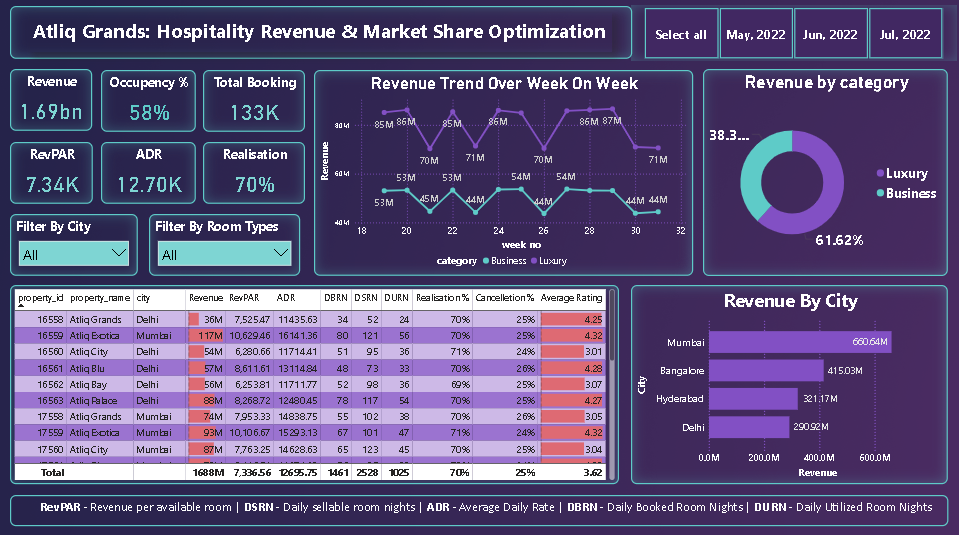

# 🏨 Hospitality Revenue & Performance Analysis Dashboard

## Project Overview

This project focuses on analyzing the revenue performance of **AtliQ Grands**, a luxury hotel chain operating across multiple cities in India.

The objective of this project is to help the revenue management team identify opportunities to improve revenue, occupancy, room utilization, and overall hotel performance through interactive business intelligence dashboards.

The project was completed using **Power BI**, **Power Query**, and **DAX** to transform raw hospitality data into actionable business insights for management.

---


## 📊 Dashboard Preview

<p align="center">
  
</p>

---

# 🎯 Business Problem Statement

AtliQ Grands has been operating in the hospitality industry for over 20 years. Due to increasing competition and ineffective management decisions, the company has experienced a decline in revenue and market share in both the luxury and business hotel segments.

Since the organization does not have an in-house analytics team, it hired a third-party data analyst to analyze historical booking data and develop an interactive dashboard that supports strategic decision-making.

The primary objectives were to:

* Build all required hospitality KPIs
* Design an interactive Power BI dashboard based on stakeholder requirements
* Generate additional business insights beyond the provided mock-up
* Support revenue optimization and occupancy improvement

---

# 🛠️ Tools & Technologies Used

* Power BI Desktop
* Power Query
* DAX (Data Analysis Expressions)
* Microsoft Excel

---

# 🔄 Project Workflow

## 🧹 1. Data Preparation & Cleaning (Power Query)

Tasks performed:

* Imported all five datasets into Power BI
* Verified and corrected data types
* Removed unnecessary whitespaces
* Checked null values and inconsistent records
* Built a Star Schema data model
* Corrected hospitality business logic:

  * Weekend → Friday & Saturday
  * Weekday → Sunday to Thursday
* Converted Week Number from text (`W 19`) to numeric values for proper Week-over-Week analysis

---

## 🧩 2. Data Modeling & DAX

Created a Star Schema using:

### 📅 Dimension Tables

* dim_date
* dim_hotels
* dim_rooms

### 📊 Fact Tables

* fact_bookings
* fact_aggregated_bookings

Developed **26 DAX measures** covering:

* Revenue
* Occupancy %
* ADR
* RevPAR
* Realisation %
* Cancellation %
* No Show Rate
* DBRN
* DSRN
* DURN
* Booking KPIs
* Week-over-Week performance metrics

---

## 📊 3. Power BI Dashboard

An interactive executive dashboard was created to visualize hotel performance.

### 🎯 KPI Cards

* Revenue
* Occupancy %
* Total Bookings
* ADR
* RevPAR
* Realisation %

### 🔎 Interactive Filters

* City
* Room Class

### 📈 Dashboard Visuals

* Revenue Trend (Week over Week)
* Revenue by Hotel Category
* Revenue by City
* Property Performance Table

The dashboard enables stakeholders to monitor revenue trends, compare hotel performance, and evaluate operational efficiency across multiple cities.

---

# 📌 Dashboard Highlights

### 📈 Revenue Trend

Analyzed weekly revenue performance for:

* Luxury Hotels
* Business Hotels

### 🏨 Revenue by Category

Compared revenue contribution between:

* Luxury Hotels
* Business Hotels

### 🌆 Revenue by City

Compared hotel revenue across:

* Mumbai
* Bangalore
* Hyderabad
* Delhi

### 🏆 Property Performance

Compared hotels using:

* Revenue
* ADR
* RevPAR
* DBRN
* DSRN
* DURN
* Realisation %
* Cancellation %
* Average Rating

---

# 📂 Project Structure

```text
hospitality-revenue-analysis/
│
├── dataset/
│   ├── dim_date.csv
│   ├── dim_hotels.csv
│   ├── dim_rooms.csv
│   ├── fact_bookings.csv
│   └── fact_aggregated_bookings.csv
│
├── dashboard/
│   └── Atliq Grands Hospitality Revenue & Market Share Optimization.pbix
│
├── reports/
│   ├── project_report.pdf
│   └── presentation.pptx
│
├── images/
│   └── dashboard.png
│
├── README.md

```

---

# Key Business Insights

* Luxury hotels generated **61.62%** of total revenue.
* Mumbai emerged as the highest revenue-generating city.
* Elite room class produced the highest revenue among all room categories.
* Overall occupancy reached **58%** across all hotels.
* The business achieved a **70% Realisation Rate**, indicating strong booking conversions.
* Property-level analysis highlighted performance variations across hotels.
* Week-over-Week revenue trends revealed seasonal fluctuations between Business and Luxury hotel categories.

---

# Business Recommendations

* Increase occupancy through targeted promotional campaigns during low-demand periods.
* Prioritize marketing investments in Mumbai and Bangalore while improving Delhi's performance.
* Promote Elite room packages through upselling and premium offerings.
* Reduce cancellations and no-shows using flexible booking policies.
* Optimize pricing strategies by continuously monitoring ADR and RevPAR.
* Track property-level KPIs to identify underperforming hotels and improve operational efficiency.

---

# Dataset Information

The dataset contains:

* Hotel Properties
* Cities
* Hotel Categories
* Room Classes
* Booking Transactions
* Booking Status
* Booking Platforms
* Revenue Generated
* Revenue Realized
* Room Capacity
* Guest Ratings
* Daily Booking Aggregates
* Calendar Information

---

# Learning Outcome

This project strengthened practical skills in:

* Data Cleaning using Power Query
* Data Modeling with Star Schema
* DAX Measure Development
* Hospitality KPI Analysis
* Interactive Dashboard Design
* Business Intelligence & Data Storytelling
* Revenue Management Analytics

---

# Acknowledgement

Special thanks to **Codebasics** and **Dhaval Patel** for providing the Hospitality Domain Power BI Project, which offered valuable hands-on experience in solving real-world business problems through data analytics.

---

# Author

**Shantanu Dhara**

Aspiring Data Analyst | Power BI 
